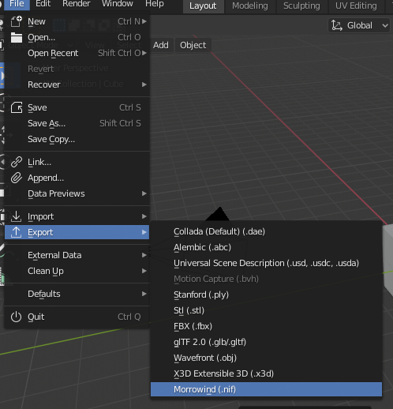

Exporting
=========

Export NIF
----------

- Exporting is done through the Blender interface: ``File -> Export -> Morrowind (.nif)``.

Export Options
--------------

- **Vertex Precision**
    Rounding precision used when optimizing vertex data. This feature is similar to Blender's native *Merge by Distance*, but differs in that it respects additional vertex data such as normals, uv coordinates, and vertex colors. In most cases there is no need to change this value from the default ``0.001``.
- **Only Collection**
    Only export objects from the active collection.
- **Only Selected**
    Only export objects that are selected.
- **Export Animations**
    Uncheck to skip all animation data during export.
- **Extract Keyframe Data**
    Extract animations and visuals to corrosponding 'x.kf' and 'x.nif' files. (e.g. exporting 'base_anim.nif' will create additional 'xbase_anim.nif' and 'xbase_anim.kf' files)
- **Preserve Material Names**
    Preserve material names from the source file. If unchecked materials will be renamed based on the assigned textures.
