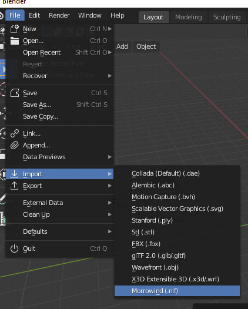

Importing
=========

Import NIF
----------

Importing is done through the Blender interface: ``File -> Import -> Morrowind (.nif)``.

.. Note:: Textures will not be imported unless you have first specified the location of your textures directory in the addon preferences menu. See the :ref:`Configuring` page.

Import Options
--------------

- **Vertex Precision**
    Rounding precision used when optimizing vertex data. This feature is similar to Blender's native *Merge by Distance*, but differs in that it respects additional vertex data such as normals, uv coordinates, and vertex colors. In most cases there is no need to change this value from the default ``0.001``.
- **Attach Keyframe Data**
    Attach animations from the corresponding .kf file. Requires file names to be an exact match. (e.g. when enabled importing 'xbase_anim.nif' will attach animations from 'xbase_anim.kf')
- **Discard Root Transforms**
    Discard the root object's transformations. In-game root transforms are overwriten with the values provided by individual cell references. Despite this some meshes do define root transformations, which can lead to unintended results if accidentally applied before exporting.
- **Preserve Material Names**
    Preserve material names from the source file. If unchecked materials will be renamed based on their assigned textures.
