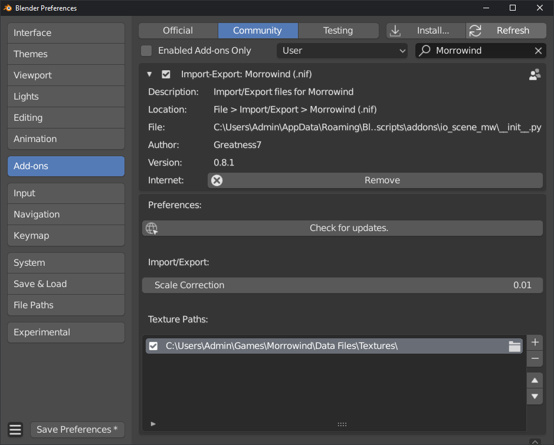

Configuring
===========

Addon Preferences
-----------------

- **Check for updates**
    Allows you to quickly and conveniently update the plugin to the latest version. This button requires a working internet connection, and will simply check the plugin repository for a newer version than is currently installed. If an update is available you will then be able to upgrade and view the changelog with an additional button press. Be sure to restart Blender after updating any addon!
- **Scale Correction**
    Adjusts how assets will be scaled upon import and export. Imported assets will be scaled down by the given value and exported assets will be scaled up by the same amount. This is useful as the very large native scale of Morrowind assets can cause issues such as viewport clipping. In most cases there is no need to change this value from the default ``0.01``.
- **Texture Paths**
    Provides a way to specify where the importer should look for texture files. This is necessary as Blender requires absolute paths for texture access despite Morrowind assets only providing relative paths. Multiple texture paths can be specified and the importer will always start with the top of the list and move downward until it resolves a valid texture.

Import Options
--------------

- **Vertex Precision**
- **Attach Keyframe Data**

Export Options
--------------

- **Vertex Precision**
- **Only Collection**
- **Only Selected**
- **Extract Keyframe Data**