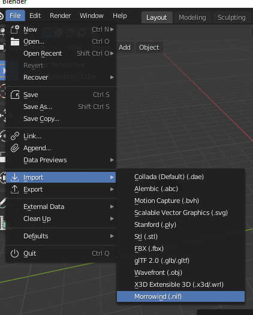

Basics
======

Importing
---------

Importing is done through the Blender interface: ``File -> Import -> Morrowind (.nif)``.

.. Note:: Textures will not be imported unless you have first specified the location of your textures directory in the addon preferences menu. See the :ref:`Configuring` page.

Exporting
---------

.. image:: ../_static/export.png

- Exporting is done through the Blender interface: ``File -> Export -> Morrowind (.nif)``.
