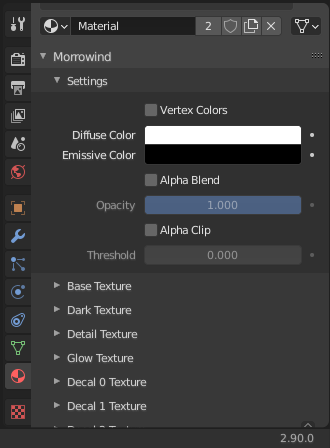
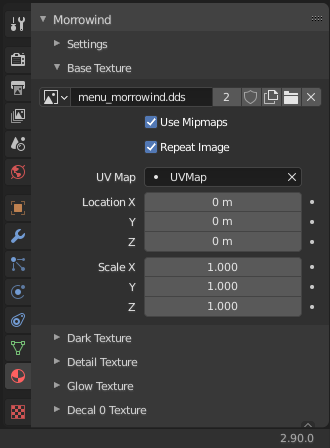

Texturing
=========

Material Creation
-----------------

.. raw:: html

   <video controls src="../_static/OpenImage_1280x704.m4v" width="640" height="352"/></video>

The recommended way to apply materials and textures to your Morrowind assets is to use the custom *Morrowind Shader* interface provided by this plugin. You can find it in under the *Morrowind* panel in the *Material Properties* tab of the `Properties Editor`_.

.. Important:: In order to view materials made by *Morrowind Shader* you must set your `Viewport Shading`_ method to **Material Preview**.

.. _Properties Editor: https://docs.blender.org/manual/en/latest/editors/properties_editor.html
.. _Viewport Shading: https://docs.blender.org/manual/en/latest/editors/3dview/display/shading.html

Material Settings
-----------------

- **Vertex Colors**
    Toggles whether the vertex colors assigned in `Vertex Paint Mode`_ will influence the material.
- **Diffuse Color**
    Defines the diffuse color to be applied to the material. This color is multiplied with the colors of the assigned texture. A pure white color would leave the texture unchanged.
- **Emissive Color**
    Defines the emissive color to be applied to the material. Brighter colors will cause the material to appear self-illuminating. A pure black color would leave the texture unchanged.
- **Alpha Blend**
    Enables alpha blending on the material which can be burther adjusted using the *Opacity* slider.
- **Alpha Clip**
    Enables alpha clipping on the material which can be further adjusted using the *Thresold* slider.

.. _Vertex Paint Mode: https://docs.blender.org/manual/en/latest/sculpt_paint/vertex_paint/introduction.html

.. Tip:: Material colors and opacity can be animated via the **insert keyframe** hotkey (default: i) while hovering over the interface elements.

Texture Slots
-------------

- **Base Texture**
    Base textures are the most common type of texture slot. They define the base color layer that may or may not be further modified by other texture slots.

- **Dark Texture**
    Dark textures are multipled with the base texture and thus will darken colors. A pure white texture would leave the colors unchanged.

    .. image:: ../_static/dark_texture_example.png
        :width: 400

- **Detail Texture**
    Detail textures are multiplied with the base texture and then multiplied again by two. This allows the detail texture to either darken *or* brighten colors. A pure gray texture would leave the colors unchanged.

- **Glow Texture**
    Glow textures are used to apply an emissive effect. Brighter areas of the texture will appear to be self-illuminating. A pure black texture would have no effect.

- **Decal Texture**
    Decal textures are used to overlay additional textures. The alpha channel of the texture defines the blending between the decal texture and the texture underneath.

.. Important:: The Morrowind engine requires textures to be **dds**, **tga**, or **bmp** format with **dimensions that are a power of two** (e.g. 256x256).

Texture Slot Options
--------------------

- **Use Mipmaps**
    Determines whether mipmaps will be enabled for the image.

- **Repeat Image**
    Determines whether the image will be repeated beyond the UV Map bounds.

- **UV Map**
    The associated UV Map for this texture slot.

- **Location / Scale**
    Animation transforms applied to the associated UV Map. Z-axis values are ignored.
